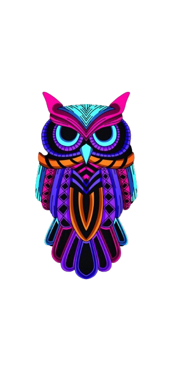
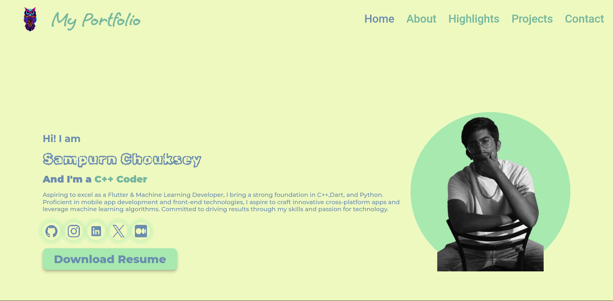

<p align="center">
  
</p>


# sampurn.me Portfolio - Flutter Version

Welcome to the Flutter-powered version of my personal portfolio website, [sampurn.me](https://www.sampurn.me). This repository contains the source code and assets for the Flutter implementation of my digital portfolio, showcasing my skills in web development and graphic design.

### *Note: The original Flutter repository can be found at [Portfolio_Website_Repo](https://github.com/Sampurn44/portfolio_website).*

## Features

- **Project Showcase:** Explore a diverse range of my projects, each demonstrating my proficiency and creativity.
- **Responsive Design:** The Flutter app is designed to provide an optimal viewing experience across various devices.
- **Contact:** Easily connect with me for inquiries, collaborations, or just to say hello.

## How to Use

1. Clone the repository:

```bash
git clone https://github.com/your-username/sampurn-flutter-portfolio.git
```
Open the project in your preferred Flutter development environment.

Run the app on an emulator or physical device to explore the portfolio.
## Technologies Used

- Flutter
- Dart

## Feedback and Collaboration

I welcome any feedback, suggestions, or potential collaborations. Feel free to reach out through the contact form on the app.

Thank you for exploring [sampurn.me](https://www.sampurn.me) in Flutter!



---


